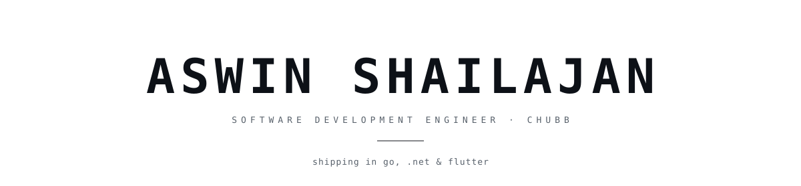
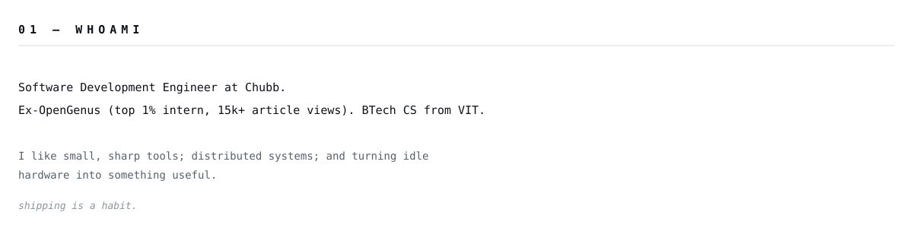
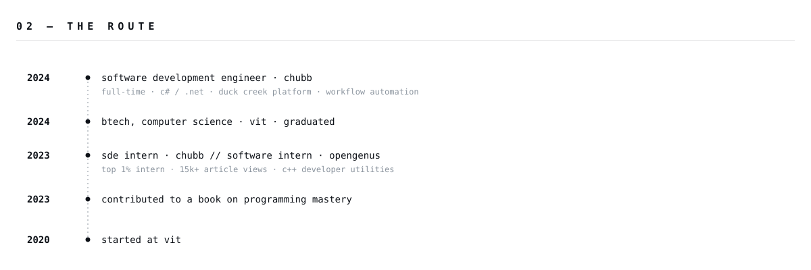
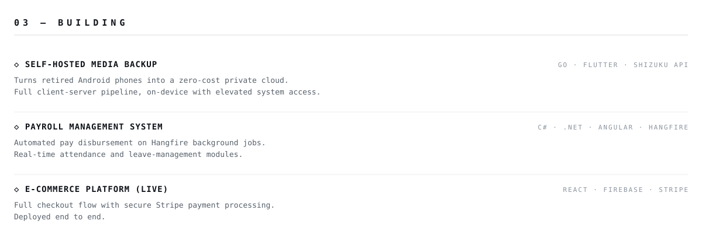
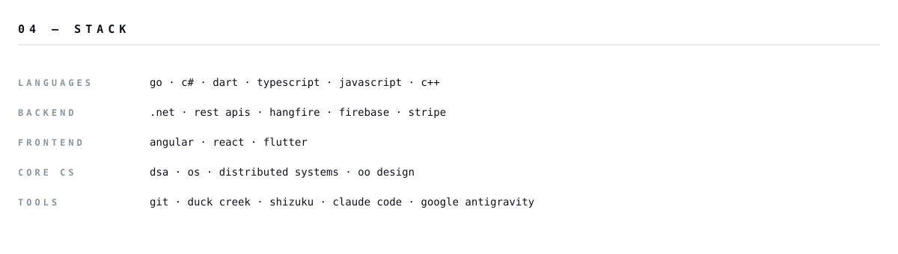
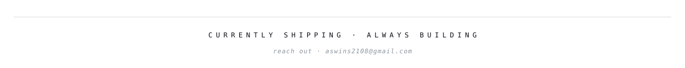

<picture><source media="(prefers-color-scheme: dark)" srcset="Assets/profile/dark/header.svg"/></picture>

<a href="https://aswin2108.github.io/Portfolio/"><picture><source media="(prefers-color-scheme: dark)" srcset="https://img.shields.io/badge/PORTFOLIO-0d1117?style=flat-square&labelColor=0d1117&color=0d1117"/></picture></a>
<a href="mailto:aswins2108@gmail.com"><picture><source media="(prefers-color-scheme: dark)" srcset="https://img.shields.io/badge/EMAIL-0d1117?style=flat-square&labelColor=0d1117&color=0d1117"/></picture></a>
<a href="https://iq.opengenus.org/author/aswin-shailajan/"><picture><source media="(prefers-color-scheme: dark)" srcset="https://img.shields.io/badge/ARTICLES-0d1117?style=flat-square&labelColor=0d1117&color=0d1117"/></picture></a>
<a href="https://www.amazon.com/Master-Programming-Practical-Projects-mastery/dp/B0BVSXHK9Z"><picture><source media="(prefers-color-scheme: dark)" srcset="https://img.shields.io/badge/BOOK-0d1117?style=flat-square&labelColor=0d1117&color=0d1117"/></picture></a>

<picture><source media="(prefers-color-scheme: dark)" srcset="Assets/profile/dark/s01-whoami.svg"/></picture>

<picture><source media="(prefers-color-scheme: dark)" srcset="Assets/profile/dark/s02-route.svg"/></picture>

<picture><source media="(prefers-color-scheme: dark)" srcset="Assets/profile/dark/s03-building.svg"/></picture>

<picture><source media="(prefers-color-scheme: dark)" srcset="Assets/profile/dark/s04-stack.svg"/></picture>

<picture><source media="(prefers-color-scheme: dark)" srcset="Assets/profile/dark/footer.svg"/></picture>
